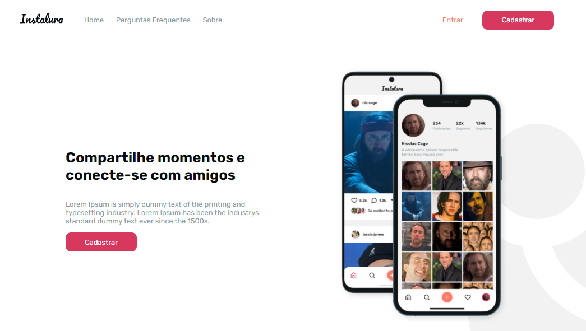

## This project was created with Next.js and styled-component during the Advanced Frontend Bootcamp

### Some of the features:
 - <b>best practices</b> for code architecture
 - Creation of foundation components such as box, grid and text
 - Modal and form creation
 - Using <b>libs resources</b> like lodash, normalize and framer-motion
 - Creation of <b>Theme Colors and Typographys</b> used throughout the application
 - Typing props with <b>prop-types</b> lib
 - applying our own <b>responsive design</b> without using external libs like bootstrap
 - including <b>eslint</b> to standardize the code
 - using <b>Context API</b>
 - using <b>useState</b> and <b>UseEffect</b>
 - applying <b>CI and CD</b> with github Action and Vercel
 - creating pages and <b>dynamic routes</b> with next.js
 - making use of <b>SEO</b> good practices
 
### Why Next JS ? 

Next is quite powerful. It comes with a lot of features for production and it´s possible to say that <b>Next</b> goes a step beyond <b>create-react-app</b>. 

### Why Styled Component ?

Having CSS in JS makes easier to maintaing the code and discard the unused css.

## Languages

### Deploying with Vercel

The easiest way to deploy a project:
 1. login vercel.com with github account
 2. import the project I want to deploy just by clicking on 'import'
 3. click on 'deploy' button :)

### To start a project with Next JS

It could be only `yarn create next-app` or, if we want the styled-components `yarn create next-app --example with-styled-components 'project name'`.
